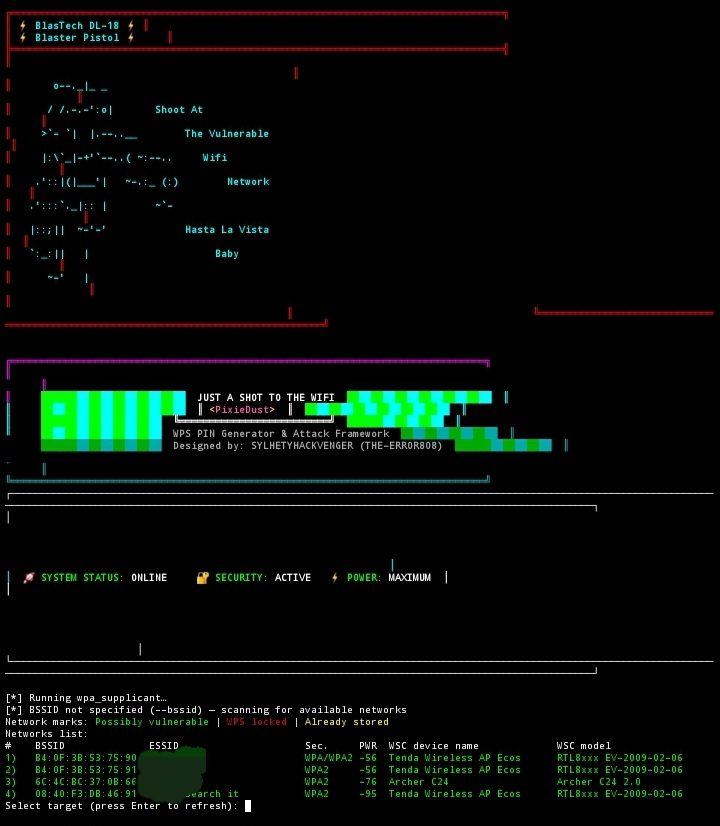
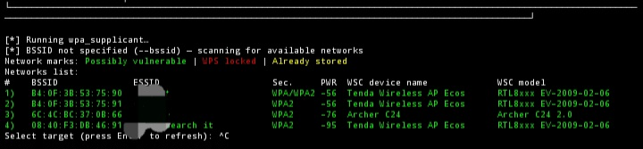

🚀 HackTheWiFi - Ultimate WPS Security Assessment Tool

https://img.shields.io/badge/Python-3.8+-blue.svg
https://img.shields.io/badge/Termux-Compatible-brightgreen.svg
https://img.shields.io/badge/License-MIT-red.svg
https://img.shields.io/badge/PRs-welcome-brightgreen.svg

<div align="center">
  
  <br>
  
</div>

⚡ What is PixieDust Attack?

The PixieDust attack is a groundbreaking WPS (Wi-Fi Protected Setup) vulnerability that can crack a router's PIN in seconds! 😱

Here's how it works:

1. The Flaw: Many routers generate WPS PINs using weak pseudo-random number generators (PRNGs) based on the device's MAC address or static algorithms
2. The Attack: PixieDust exploits the fact that during the WPS handshake, the router sends cryptographic data (E-Hash1, E-Hash2, PKE, PKR) that can be used offline to calculate the PIN
3. The Speed: Instead of trying 11,000 PIN combinations (which takes hours), PixieDust calculates the correct PIN in under 60 seconds ⚡

🔥 Why It's So Powerful:

· Blazing Fast: Cracks WPS PINs in seconds, not hours
· Offline Attack: Calculates PINs without sending thousands of requests
· Comprehensive: Supports 50+ router brands including D-Link, TP-Link, ASUS, NETGEAR, Huawei, and more
· Smart Detection: Automatically identifies vulnerable devices based on OUI (MAC address prefix)
· All-in-One: Combines PixieDust, brute-force, and PIN generation in one tool

🎯 Vulnerability Assessment Power:

This tool doesn't just hack WiFi - it's a complete security assessment suite that:

· 🔍 Scans for vulnerable WPS-enabled routers
· 📊 Analyzes router models and firmware versions
· 🎯 Identifies weak PIN generation algorithms
· 🛡️ Generates comprehensive security reports
· 💾 Saves successful credentials for auditing

📦 Installation

For Termux (Android):

```bash
# Update packages
pkg update && pkg upgrade -y

# Install required packages
pkg install tsu python git root-repo -y
pkg install wpa-supplicant pixiewps iw openssl -y
termux-setup-storage

# Clone repository
git clone https://github.com/sylhetyhackvenger/HackTheWiFi.git
cd HackTheWiFi

# Install Python dependencies
pip install -r requirements.txt
```

For Linux (Kali/Ubuntu/Debian):

```bash
# Install dependencies
sudo apt update
sudo apt install python3 python3-pip git wireless-tools wpa-supplicant pixiewps -y

# Clone repository
git clone https://github.com/sylhetyhackvenger/HackTheWiFi
cd HackTheWiFi

# Install Python dependencies
pip3 install -r requirements.txt
```

🚀 Usage Examples

Basic Scan & Attack:

```bash
# Run PixieDust attack on a specific BSSID
sudo python HackTheWiFi.py -i wlan0 -b 00:11:22:33:44:55 -K

# Scan for vulnerable networks and attack
sudo python HackTheWiFi.py -i wlan0 -K -l

# Bruteforce with saved session
sudo python HackTheWiFi.py -i wlan0 -B

# Push Button Connect (PBC)
sudo python HackTheWiFi.py -i wlan0 --pbc
```

Advanced Options:

```bash
# PixieDust with force mode (full range bruteforce)
sudo python HackTheWiFi.py -i wlan0 -K -F

# Verbose output + save credentials
sudo python HackTheWiFi.py -i wlan0 -K -w -v

# Loop mode with reverse scan
sudo python HackTheWiFi.py -i wlan0 -K -l -r

# Custom delay between attempts
sudo python HackTheWiFi.py -i wlan0 -B -d 0.5
```

🎨 Features

Feature Description
🚀 PixieDust Attack Cracks WPS PIN in seconds using cryptographic flaws
🔓 Online Bruteforce Smart bruteforce with session saving
📡 Network Scanner Detects WPS-enabled networks with signal strength
🎯 Vulnerability DB 500+ vulnerable device models pre-loaded
💾 Credential Saving Auto-saves WPA PSK and WPS PIN
📊 Reports Generates TXT, CSV reports with timestamps
🔄 Loop Mode Continuous scanning and attacking
🌐 MTK WiFi Support Works with MediaTek WiFi chips

📋 Requirements

```txt
pip install wcwidth
```

🛡️ Ethical Usage

⚠️ IMPORTANT: This tool is for educational and authorized testing purposes ONLY!

· ✅ Test on your own networks
· ✅ Test on networks you have explicit written permission to test
· ✅ Use in controlled lab environments
· ❌ NEVER use on unauthorized networks
· ❌ NEVER use for malicious purposes

🤝 Contributing

Want to make this tool even more powerful? We welcome contributions!

1. Fork the repository
2. Create your feature branch (git checkout -b feature/AmazingFeature)
3. Commit changes (git commit -m 'Add AmazingFeature')
4. Push to branch (git push origin feature/AmazingFeature)
5. Open a Pull Request

📝 License

Distributed under the MIT License. See LICENSE for more information.

🙏 Acknowledgments

· rofl0r - Original OneShotPin creator
· drygdryg - Modifications and improvements
· SYLHETYHACKVENGER (THE-ERROR808) - I tried to do some enhancements
· WiFi Security Community - Vulnerability research

---

<div align="center">
  <sub>Built with ❤️ for the Security Community</sub>
  <br>
  <sub>⚠️ Use responsibly and ethically ⚠️</sub>
</div>
